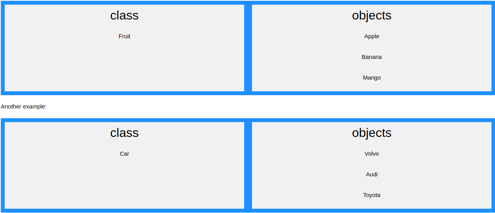

# Bài tập OOP in PHP

Thực hiện bởi : [Nguyễn Đình Phong](https://github.com/phongnguyen195p2001)

Cách sử dụng kết quả:

- Download code và run code tại đường dẫn https://github.com/phongnguyen195p2001/OOP

# OOP

**OOP** ( Viết tắt của Object Oriented Progamming ) - Lập trình hướng đối tượng là một phương pháp lập trình dựa trên
khái niệm lớp và đối tượng. OOP tập trung hơn vào cái đối tượng hơn là khai thác logic để thao tác chúng, giúp code dẽ
quản lý, tái sử dụng được và dễ bảo trì

**Ưu điểm:**

- OOP nhanh hơn và dễ thực thi hơn

- OOP cung cấp một cấu trúc rõ ràng cho các chương trình

- OOP giúp giữ cho mã PHP "Không lặp lại chính bạn" và làm cho mã dễ bảo trì, sửa đổi và gỡ lỗi hơn

- OOP giúp bạn có thể tạo các ứng dụng có thể tái sử dụng đầy đủ với ít mã hơn và thời gian phát triển ngắn hơn

- OOP mô hình hóa những thứ phức tạp dưới dạng cấu trúc đơn giản.

- Code OOP có thể sử dụng lại, giúp tiết kiệm tài nguyên.

- Giúp sửa lỗi dễ dàng hơn. So với việc tìm lỗi ở nhiều vị trí trong code thì tìm lỗi trong các lớp (được cấu trúc từ
  trước) đơn giản và ít mất thời gian hơn.

- Có tính bảo mật cao, bảo vệ thông tin thông qua đóng gói.

- Dễ mở rộng dự án.

## Một vài khái niệm cơ sở về OOP

### Class và Object

**Đối tượng (Object)**

Đối tượng trong OOP bao gồm 2 thành phần chính:

- Thuộc tính (Attribute): là những thông tin, đặc điểm của đối tượng

- Phương thức (Method): là những hành vi mà đối tượng có thể thực hiện

- Class không là gì nếu không có object! Chúng ta có thể tạo nhiều đối tượng từ một class. Mỗi đối tượng có tất cả các
  thuộc tính và phương thức được định nghĩa trong clss, nhưng chúng sẽ có các giá trị thuộc tính khác nhau.

```php
<?php
class Fruit {
  // Properties
  public $name;
  public $color;

  // Methods
  function set_name($name) {
    $this->name = $name;
  }
  function get_name() {
    return $this->name;
  }
  function set_color($color) {
    $this->color = $color;
  }
  function get_color() {
    return $this->color;
  }
}

$apple = new Fruit();
$apple->set_name('Apple');
$apple->set_color('Red');
echo "Name: " . $apple->get_name();
echo "<br>";
echo "Color: " . $apple->get_color();
?>
```

**Lớp (Class):**

Lớp là sự trừu tượng hóa của đối tượng. Những đối tượng có những đặc tính tương tự nhau sẽ được tập hợp thành một lớp.
Lớp cũng sẽ bao gồm 2 thông tin là thuộc tính và phương thức.

Một đối tượng sẽ được xem là một thực thể của lớp.

Một lớp được định nghĩa bằng cách sử dụng từ khóa class, theo sau là tên của lớp và một cặp dấu ngoặc nhọn ({}). Tất cả
các thuộc tính và phương pháp của nó đều đi vào bên trong dấu ngoặc nhọn:

```php
<?php
class Fruit {
  // Properties
  public $name;
  public $color;

  // Methods
  function set_name($name) {
    $this->name = $name;
  }
  function get_name() {
    return $this->name;
  }
}

$apple = new Fruit();
$banana = new Fruit();
$apple->set_name('Apple');
$banana->set_name('Banana');

echo $apple->get_name();
echo "<br>";
echo $banana->get_name();
?>
```

### Sự khác biệt giữa Class và Objects

**Example:**



### $this

- Từ khóa $this đề cập đến đối tượng hiện tại và chỉ có sẵn bên trong các phương thức.

```php
<?php
class Fruit {
  public $name;
}
$apple = new Fruit();
?>
```

- Vì vậy, chúng ta có thể thay đổi giá trị của thuộc tính $name ở đâu? Có hai cách:

1. Bên trong lớp (bằng cách thêm phương thức set_name () và sử dụng $this):

```php
<?php
class Fruit {
  public $name;
  function set_name($name) {
    $this->name = $name;
  }
}
$apple = new Fruit();
$apple->set_name("Apple");

echo $apple->name;
?>
```

2. Bên ngoài lớp (bằng cách thay đổi trực tiếp giá trị thuộc tính):

```php
<?php
class Fruit {
  public $name;
}
$apple = new Fruit();
$apple->name = "Apple";

echo $apple->name;
?>
```

## 4 đặc tính cơ bản của OOP

### Tính đóng gói (Encapsulation)

Tính đóng gói cho phép che giấu thông tin và những tính chất xử lý bên trong của đối tượng. Các đối tượng khác không thể
tác động trực tiếp đến dữ liệu bên trong và làm thay đổi trạng thái của đối tượng mà bắt buộc phải thông qua các phương
thức công khai do đối tượng đó cung cấp.

Tính chất này giúp tăng tính bảo mật cho đối tượng và tránh tình trạng dữ liệu bị hư hỏng ngoài ý muốn.


#### Access Modifiers

Các thuộc tính và phương thức có thể có các công cụ sửa đổi quyền truy cập kiểm soát nơi chúng có thể được truy cập.

- **public** - thuộc tính hoặc phương thức có thể được truy cập từ mọi nơi. Đây là mặc định.
- **protected** - thuộc tính hoặc phương thức có thể được truy cập trong lớp và bởi các lớp dẫn xuất từ lớp đó.
- **private** - thuộc tính hoặc phương thức CHỈ có thể được truy cập trong lớp.

```php
<?php
class Fruit {
  public $name;
  protected $color;
  private $weight;
}

$mango = new Fruit();
$mango->name = 'Mango'; // OK
$mango->color = 'Yellow'; // ERROR
$mango->weight = '300'; // ERROR
?>
```

### Tính kế thừa (Inheritance)

Kế thừa trong OOP là khi một lớp dẫn xuất từ một lớp khác.

Lớp con sẽ kế thừa tất cả các thuộc tính và phương thức public và protected từ lớp cha. Ngoài ra, nó có thể có các thuộc
tính và phương thức riêng.

Một lớp kế thừa được định nghĩa bằng từ khóa **Extends**.

```php
<?php
class Fruit {
  public $name;
  public $color;
  public function __construct($name, $color) {
    $this->name = $name;
    $this->color = $color;
  }
  public function intro() {
    echo "The fruit is {$this->name} and the color is {$this->color}.";
  }
}

// Strawberry is inherited from Fruit
class Strawberry extends Fruit {
  public function message() {
    echo "Am I a fruit or a berry? ";
  }
}
$strawberry = new Strawberry("Strawberry", "red");
$strawberry->message();
$strawberry->intro();
?>
```

#### Overriding Inherited Methods(Ghi đè các phương thức kế thừa)

Các phương thức kế thừa có thể được ghi đè bằng cách định nghĩa lại các phương thức (sử dụng cùng một tên) trong lớp
con.

```php
<?php
class Fruit {
  public $name;
  public $color;
  public function __construct($name, $color) {
    $this->name = $name;
    $this->color = $color; 
  }
  public function intro() {
    echo "The fruit is {$this->name} and the color is {$this->color}."; 
  }
}

class Strawberry extends Fruit {
  public $weight;
  public function __construct($name, $color, $weight) {
    $this->name = $name;
    $this->color = $color;
    $this->weight = $weight; 
  }
  public function intro() {
    echo "The fruit is {$this->name}, the color is {$this->color}, and the weight is {$this->weight} gram."; 
  }
}

$strawberry = new Strawberry("Strawberry", "red", 50);
$strawberry->intro();
?>
```

### Tính đa hình (Polymorphism)

Tính đa hình trong lập trình OOP cho phép các đối tượng khác nhau thực thi chức năng giống nhau theo những cách khác
nhau.

```php
<?php
// Interface definition
interface Animal {
  public function makeSound();
}

// Class definitions
class Cat implements Animal {
  public function makeSound() {
    echo " Meow ";
  }
}

class Dog implements Animal {
  public function makeSound() {
    echo " Bark ";
  }
}

class Mouse implements Animal {
  public function makeSound() {
    echo " Squeak ";
  }
}

// Create a list of animals
$cat = new Cat();
$dog = new Dog();
$mouse = new Mouse();
$animals = array($cat, $dog, $mouse);

// Tell the animals to make a sound
foreach($animals as $animal) {
  $animal->makeSound();
}
?>
```

### Tính trừu tượng (Abstraction)

Abstract classes và phương thức là khi lớp cha có một phương thức được đặt tên, nhưng cần class(es) con của nó để điền
các tác vụ.

Một lớp trừu tượng là một lớp có chứa ít nhất một phương thức trừu tượng. Một phương thức trừu tượng là một phương thức
được khai báo, nhưng không được triển khai trong mã.

Một lớp hoặc phương thức trừu tượng được định nghĩa bằng từ khóa **abstract**:

```php
<?php
// Parent class
abstract class Car {
  public $name;
  public function __construct($name) {
    $this->name = $name;
  }
  abstract public function intro() : string; 
}

// Child classes
class Audi extends Car {
  public function intro() : string {
    return "Choose German quality! I'm an $this->name!"; 
  }
}

class Volvo extends Car {
  public function intro() : string {
    return "Proud to be Swedish! I'm a $this->name!"; 
  }
}

class Citroen extends Car {
  public function intro() : string {
    return "French extravagance! I'm a $this->name!"; 
  }
}

// Create objects from the child classes
$audi = new audi("Audi");
echo $audi->intro();
echo "<br>";

$volvo = new volvo("Volvo");
echo $volvo->intro();
echo "<br>";

$citroen = new citroen("Citroen");
echo $citroen->intro();
?>
```

### Hàm __construct

Một hàm tạo cho phép bạn khởi tạo các thuộc tính của đối tượng khi tạo đối tượng.

```php
<?php
class Fruit {
  public $name;
  public $color;

  function __construct($name) {
    $this->name = $name;
  }
  function get_name() {
    return $this->name;
  }
}

$apple = new Fruit("Apple");
echo $apple->get_name();
?>
```

### Hàm __destruct

Một trình hủy được gọi khi đối tượng bị hủy hoặc tập lệnh bị dừng hoặc thoát.

```php
<?php
class Fruit {
  public $name;
  public $color;

  function __construct($name) {
    $this->name = $name;
  }
  function __destruct() {
    echo "The fruit is {$this->name}.";
  }
}

$apple = new Fruit("Apple");
?>
```

### Traits

- PHP chỉ hỗ trợ kế thừa đơn: một lớp con chỉ có thể kế thừa từ một lớp cha duy nhất.
- Traits được sử dụng để khai báo các phương thức có thể được sử dụng trong nhiều lớp. Traits có thể có các phương
  thức và phương thức trừu tượng có thể được sử dụng trong nhiều lớp và các phương thức có thể có bất kỳ công cụ sửa đổi
  quyền truy cập nào (public, private hoặc protected).

```php
<?php
trait message1 {
public function msg1() {
    echo "OOP is fun! ";
  }
}

class Welcome {
  use message1;
}

$obj = new Welcome();
$obj->msg1();
?>
```

### Static Methods

- Phương thức static có thể được gọi trực tiếp - mà không cần khởi tạo một lớp trước.

```php
<?php
class greeting {
  public static function welcome() {
    echo "Hello World!";
  }
}

// Call static method
greeting::welcome();
?>
 ```

### Static Properties

- Các thuộc tính static có thể được gọi trực tiếp - mà không cần tạo một thể hiện của một lớp.

```php
<?php
class pi {
  public static $value = 3.14159;
}

// Get static property
echo pi::$value;
?>
```

### Namespaces

Namespaces là các vòng loại giải quyết hai vấn đề khác nhau:

1. Chúng cho phép tổ chức tốt hơn bằng cách nhóm các lớp làm việc cùng nhau để thực hiện một nhiệm vụ

2. Chúng cho phép sử dụng cùng một tên cho nhiều lớp

```php
namespace Html;
class Table {
  public $title = "";
  public $numRows = 0;
  public function message() {
    echo "<p>Table '{$this->title}' has {$this->numRows} rows.</p>";
  }
}
$table = new Table();
$table->title = "My table";
$table->numRows = 5;
?>

<!DOCTYPE html>
<html>
<body>

<?php
$table->message();
?>

</body>
</html>
```

### Extend vs implements

**extends**: mở rộng. Kế thừa và mở rộng từ một lớp (class) có sẵn.

**implements**: triển khai. Thực hiện triển khai (định nghĩa) các phương thức đã được khai báo từ một hoặc nhiều giao tiếp (
interface).

### Class Constants

Không thể thay đổi các hằng sau khi nó được khai báo.

Hằng số lớp có thể hữu ích nếu bạn cần xác định một số dữ liệu hằng số trong một lớp.

Hằng số lớp được khai báo bên trong một lớp với từ khóa const.

Chúng ta có thể truy cập một hằng số từ bên ngoài lớp bằng cách sử dụng tên lớp theo sau là toán tử phân giải phạm
vi (: :) theo sau là tên hằng số, như ở đây:

```php
<?php
class Goodbye {
  const LEAVING_MESSAGE = "Thank you for visiting https://github.com/phongnguyen195p2001/OOP !";
}

echo Goodbye::LEAVING_MESSAGE;
?>
```


